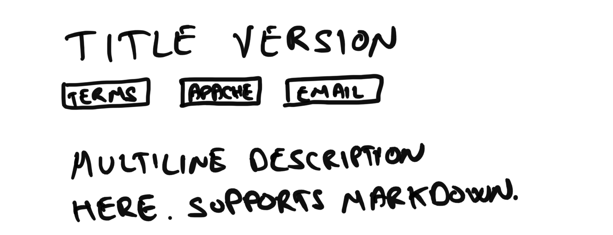
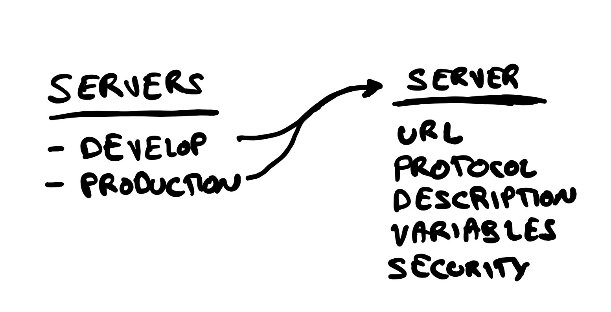

# AsyncAPI UI Component Library

Create a UI library of easily customizable components, including the current React component, redesigned.

## Problem

The current React component is very tied to SAP styling, and lacks some features present in the HTML template. It also introduces yet another playground that we're not maintaining and would love to get rid of. Also, some people are asking to have just some parts of the documentation embedded in their docs. In other words, they don't want the full HTML page, just some _components_ of it.

## Solution

We're going to create a UI components library for AsyncAPI. For now, **it must only work with React**. Other frameworks will be considered in the future.

The UI library must have an interactive application where we can test the components in isolation. To avoid creating yet another playground, we should rely on something like [Storybook](https://storybook.js.org). It would also be great that we get used to develop components in isolation and then add them to the final app, which in this case is the _parent_ React component.

There should be, at least, the following _top-level_ components.

### Top-level components

#### Info

A component showing information about the API. It usually maps to the `info` object in an AsyncAPI document.

#### List of servers

A component showing the list of available servers/brokers and how to connect to them.

#### Server

A single server/broker. It must include the URL, protocol and protocol version, description, and information about the authentication mechanisms needed —if any— and the server variables —if any.

#### Operation

The purpose of this component is to illustrate wether it's a publish or subscribe operation, its details (summary, description, operationId, etc.), and the related message.

#### Operations mixed with channels

In many cases, people are more interested in operations as a first-class object than the channels themselves. It would be great to show operation and channel information at a glance, ala HTML template.

#### List of channels with operations inside

A list of channels detailing each channel's details (summary, description, etc.), and the operations affecting this channel. Operations should use the previously defined `Operation` component.

#### List of messages

A list of the messages an AsyncAPI document is defining or referencing. This component must be configurable to show: a) every message on the spec; b) only the messages defined under the `components` section.

#### Message

The details of a message: summary, description, title, headers, payload, correlationId, tags, etc.

When showing examples, they must be visible for the whole height of the "section" (sticky position).

#### List of schemas

A list of the schemas an AsyncAPI document is defining or referencing. This component must be configurable to show: a) every schema on the spec; b) only the schemas defined under the `components` section.

Along with the previous options, it should be possible to also specify the following configuration: a) schemas of any type (default); b) schemas of type array or object.

#### Schema

The details of a schema: description, type, required, maximum, minimum, maxLength, minLength, etc.

When showing examples, they must be visible for the whole height of the "section" (sticky position).

#### Documentation

This will be the replacement for the current React component. It's a configurable component that allows you to showcase your AsyncAPI documentation, using a combination of the components defined before and a navigation menu.

##### Customization

It should be easy to customize the components. Not just at CSS level but also at markup level. For instance, if someone wants to use their own Message component, it should be easily doable.

##### Improved navigation and readability

The current navigation of the HTML template is, by default, based on a combination of the operation verb + the channel name. This makes it difficult to read when the channel names are long, which is almost always.

In this new component, the navigation should be grouped by tags by default. Each section title and each item of the navigation menu must be composed as follows (in order of priority):

1. PUB/SUB + Operation Summary. Channel name should be indicated somewhere else.
1. PUB/SUB + Operation Id. Channel name should be indicated somewhere else.
1. PUB/SUB + Operation Description. Channel name should be indicated somewhere else.
1. PUB/SUB + Channel name.

### CSS architecture

We should aim for a utility-first approach because that will give us a lot of flexibility for quickly iterating on prototypes. To be more specific, TailwindCSS sounds like the best choice here. It will give us a lot of things for free: great color palette, sane typography defaults, easy way to extend, easy way to create themes and dark mode, responsiveness, and a great community.

Happy to reconsider TailwindCSS for another option like styled-components if we think that's the best way to proceed.

## Rabbit holes & challenges

Let's be careful with trying to make something super cool in this first iteration. Especially with adding too many "props" to the components. Remember, we'll keep iterating in the future.

Also, let's try to integrate all of them as soon as possible. I mean, we don't need to finish one component to start another one, instead, let's do the minimum on each of them to quickly see how they all fit together. Once we have everything "integrated", we can work on finishing each component.

## Out of bounds

1. Other frameworks like Vue, WebComponents, Ember, etc. Only pure HTML should be considered as a nice to have.
1. Expand/Collapse functionality at section level. The only interactivity we're going to add in this iteration is expand/collapse of object properties and, in case it's needed, the show/hide navigation functionality.
1. Support for bindings on any component.